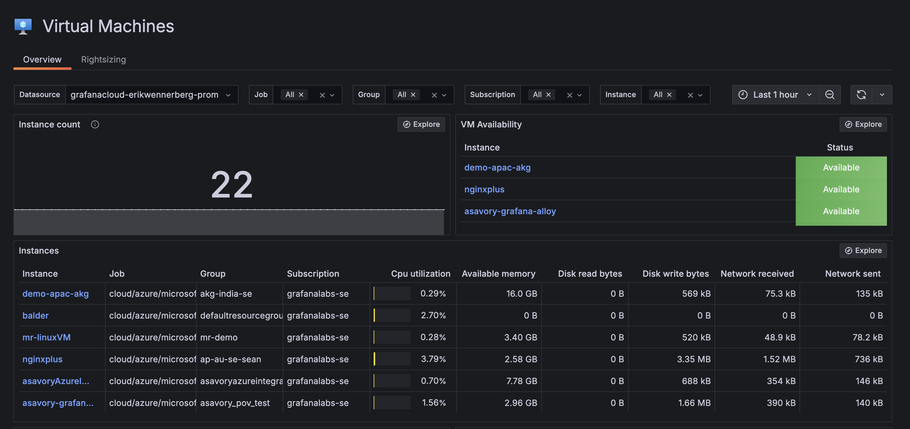

# Azure Grafana Cloud Integration Demo

## What does this do?
This is a terraform project that installs a simple three tier architecture sample application on Azure and integrates this with your Grafana Cloud tenant via our agentless integration.
The 3 tier architecture is comprised of a frontend, a backend each on an Azure VM and an Azure Mssql DB. Each tier has its own subnet as per best practices.
This will alloy you to discover and try out Grafana cloud observability for Azure 

## What you'll need
- [Terraform](https://www.terraform.io/downloads.html)
- [Azure CLI](https://learn.microsoft.com/en-us/cli/azure/install-azure-cli)
- A Grafana cloud tenant

### Deployment Steps

**Step 0** \
Make sure you are logged in with your user principal with the Azure CLI. That's what the Azure provider in this project will rely on. \
git clone this repository 

**Step 1** \
We will need to set the following environment variables: \
`export TF_VAR_org_slug="your grafana org slug"` \
`export TF_VAR_grafana_cloud_region="your grafana cloud region"` - find it in the cloud portal: [Grafana docs - Grafana portal](https://grafana.com/docs/grafana-cloud/security-and-account-management/cloud-portal/) \
`export TF_VAR_azure_subscription_id="your azure subscription id where you want this stack to live and pull metrics from"` \
`export TF_VAR_org_id="org id"` - you can find your org id in the cloud portal \
`export TF_VAR_grafana_tf_access_policy_token="access policy token to be able to use Grafana cloud APIs with terraform" ` as per [Grafana docs - Grafana tf provider](https://grafana.com/docs/grafana-cloud/monitor-infrastructure/monitor-cloud-provider/azure/collect-azure-serverless/config-azure-metrics-serverless/#create-an-access-policy-for-the-grafana-terraform-provider) \
`export TF_VAR_azure_app_registration_client_secret="your app registration client secret value"` 

**Step 2** \
`terraform init`

**Step 3** \
`terraform plan`

**Step 4** \
`terraform apply`

## TODO
- Include log integration througth event hub
- Install Alloy to pull metrics/logs/traces from the sample 3 tier application
- Create Grafana access policy with terraform

